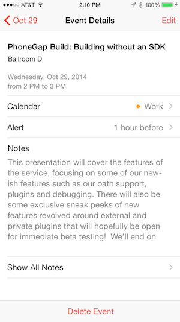

In this section, we add the ability to add a session to the native calendar on the device.
### Steps

1. Add this calendar plugin to your project:

    ```
    $ ionic plugin add https://github.com/EddyVerbruggen/Calendar-PhoneGap-Plugin.git
    
    ```

2. In **index.html**, wire the calendar item in the session.html template to the **addToCalendar** function such as:

    ```
   <p>{{session.room}} | {{session.time}}
           <a class="tab-item addCal" ng-click="addToCalendar()">
           <i class="icon ion-calendar" style="font-size: 16px">
               Add</i></a></button>
    </p>
    ```

4. Open **controllers.js** and define the *shareNative* function to the **sessionCtrl** as follows:

    ```
    $scope.addToCalendar = function() {
        if (window.plugins && window.plugins.calendar) {
            var hour = $scope.session.time.substring(0,$scope.session.time.indexOf(':'));
            if ($scope.session.time.indexOf("pm")>-1)
                hour = parseInt(hour)+12;
            var today = new Date();
            console.log("Date year" + today.getFullYear() + " mo " + today.getMonth()+ " day " + today.getDate());
            var startDate = new Date(today.getFullYear(),today.getMonth(),today.getDate(),hour,00,00);
            var endDate = new Date();
            endDate.setTime(startDate.getTime() + 3600000);//one hour

            window.plugins.calendar.createEvent($scope.session.title, $scope.session.room, $scope.session.description, startDate, endDate,
                function () {
                    alert($scope.session.title + " has been added to your calendar.");
                },
                function (error) {
                    console.log("Calendar fail " + error);
                });
        }
        else console.log("Calendar plugin not available.");
    }    
    ```

5. Test the Application

When you click the add calendar icon, you should see a toast notification popup and a new entry added to your native calendar for today's date 
at the session time such as below:

    
 
>On the simulator use shift+cmd+h to get to the home screen to find the calendar to verify.
 
<div class="row" style="margin-top:40px;">
<div class="col-sm-12">
<a href="hardware-acceleration.html" class="btn btn-default"><i class="glyphicon glyphicon-chevron-left"></i> 
Previous</a>
<a href="share.html" class="btn btn-default pull-right">Next <i class="glyphicon 
glyphicon-chevron-right"></i></a>
</div>
</div>


